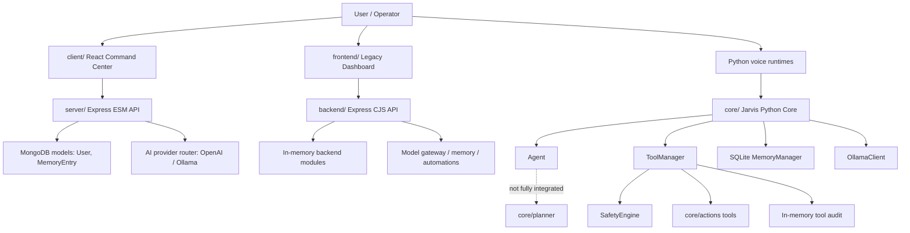
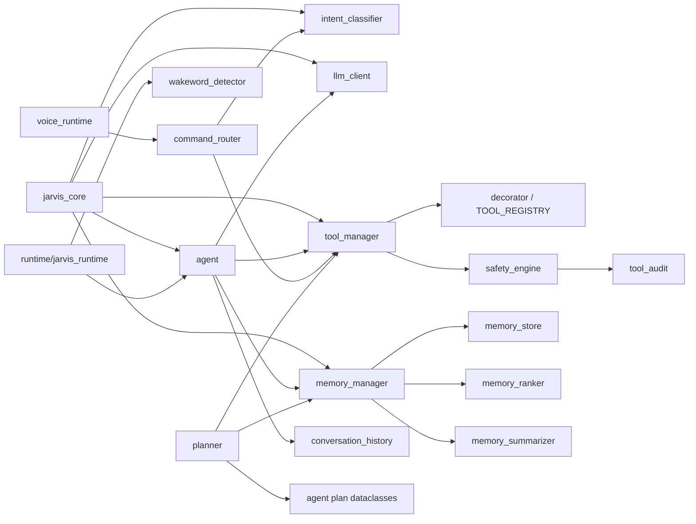
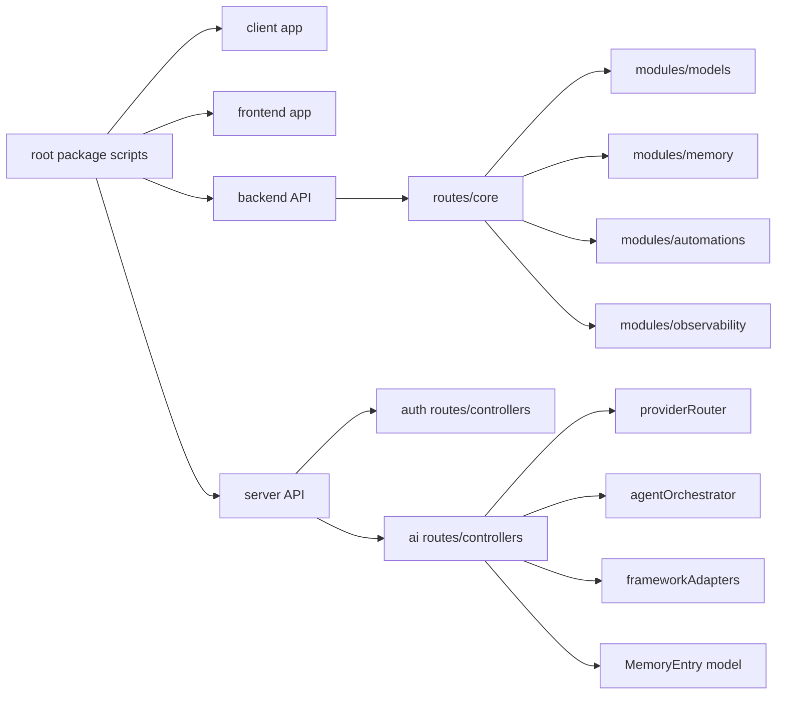

# JARVIS INDIA OS - Architecture Audit

Audit date: 2026-05-31

## Current Architecture Diagram

## Dependency Graph

Python core:

Node/API graph:

Detected circular dependencies:
- None in Python AST graph.
- No missing relative JS imports.

## Architecture Assessment

The repository currently has a **polyglot prototype architecture**:
- Python `core/` is the intelligence and local execution center.
- `server/` appears to be the newer product API with auth, MongoDB, Socket.io direction, and AI provider routing.
- `backend/` is a smaller CommonJS API with API-key protection and simplified module contracts.
- `client/` is the newer command-center UI.
- `frontend/` is a legacy dashboard UI.

The main architectural issue is not absence of code; it is absence of a single authoritative runtime path.

## Memory System Status

Status: **Partially implemented**

Implemented:
- SQLite-backed `core/memory/memory_store.py`
- `MemoryManager` with long-term and short-term memory
- keyword search and ranking
- summarization helper
- memory tools: save, search, recent, delete
- MongoDB `MemoryEntry` model in `server/`
- simple in-memory memory module in `backend/`

Gaps:
- No unified memory contract across Python, `server/`, and `backend/`
- No vector store/semantic retrieval
- No memory permissions or privacy partitioning
- No memory migration/versioning
- No production backup/retention strategy

Verdict: local memory works; production memory is not ready.

## Planner Status

Status: **Skeletal**

Implemented:
- `AgentPlan` / `AgentStep` dataclasses
- plan parsing inside `core/agent.py`
- plan validation contracts in `core/planner/plan_contracts.py`
- planner wrapper in `core/planner/planner.py`
- step expander and checkpoint engine shells

Gaps:
- `Planner.optimize()` is not wired into active `Agent.run_task()`
- enrichment TODO
- normalization TODO
- self-correction TODO
- step expansion TODO
- checkpoint policy TODO
- no plan persistence
- no plan execution state machine
- no rollback/retry model

Verdict: planner shape exists, but autonomous-grade planning is not implemented.

## Execution Engine Status

Status: **Fragmented but functional for local tasks**

Implemented:
- `JarvisAICore.process()` coordinates LLM, intent fallback, agent, memory, and tools.
- `Agent.run_task()` can parse a plan and execute tool steps.
- `ToolManager.execute_tool()` gates and invokes registered tools.
- Voice runtimes can route spoken commands.

Gaps:
- No single `ExecutionEngine` abstraction.
- No durable workflow/run state.
- No async worker queue for long-running actions.
- No command isolation/sandboxing.
- No rollback or compensation actions.
- No trace context from UI/API to Python execution.

Verdict: usable as local assistant logic; not stable enough for autonomous release.

## Tool System Status

Status: **Moderately implemented**

Implemented:
- decorator-based registry
- dynamic discovery across `core`
- metadata for description, sensitivity, permission
- execution gateway
- sensitive action confirmation
- audit emission
- app/file/folder/browser/search/system tools

Gaps:
- Tool discovery is broad dynamic import, not a manifest-based registry.
- No typed tool input/output schemas.
- No per-tool timeout, retry, sandbox, or rate limit.
- No permission matrix owned by product/API identity.
- No tool versioning or capability registry.

Verdict: strong foundation; needs schema, isolation, and identity propagation.

## Safety Status

Status: **Early implementation, not production-safe**

Implemented:
- `SafetyEngine.authorize()`
- role hierarchy: guest, user, power, admin, system
- sensitive tools require `confirm=True`
- denied executions return a reason
- audit events are recorded

Critical gaps:
- Caller identity is not propagated end-to-end from UI/API to Python tool execution.
- Audit storage is process-local and non-durable.
- No approval queue.
- No policy-as-code or environment-specific policy.
- No sandboxing for OS/file/process actions.
- Hardcoded API keys are present in legacy/prototype files.

Verdict: safety exists as a code layer, but not yet as a system guarantee.

## Telemetry Status

Status: **Minimal**

Implemented:
- `backend/src/middlewares/telemetry.js`
- `backend/src/modules/observability/telemetry.js`
- request logging in backend/server
- in-memory Python tool audit

Gaps:
- No OpenTelemetry traces.
- No metrics endpoint for Prometheus-style scraping.
- No structured event schema across Python and Node.
- No correlation ID/request ID.
- No durable audit sink.
- No alerting or dashboards.

Verdict: enough for smoke visibility; not production observability.

## Multi-Agent Readiness

Status: **Not ready**

Implemented:
- Single `Agent` class.
- Server-side `agentOrchestrator.js` plan metadata.
- Compatibility adapters for LangChain/CrewAI/AutoGen style outputs.
- Root `agent.py` LangGraph prototype.

Gaps:
- No multi-agent roles.
- No coordinator/supervisor.
- No shared blackboard/task state.
- No agent memory isolation.
- No conflict resolution.
- No tool budget/rate allocation.
- No agent-to-agent messaging protocol.

Verdict: current system is single-agent with multi-agent naming/adapters.

## Broken Import / Runtime Findings

Broken:
- `voice.py` imports missing module `sr`.

Security runtime blockers:
- `python-core/jarvis.py` contains hardcoded Groq and weather API keys.
- root `agent.py` contains a hardcoded Groq API key.

Testing blocker:
- `pytest` is absent from both system Python and project venv.

## Dead / Duplicate Architecture Findings

Dead or orphan candidates:
- `Jarvis-Brain.py`
- `startup.py`
- `main.py`
- `voice.py`
- `python-core/jarvis.py`
- root `agent.py`

Duplicate architectural surfaces:
- `client/` vs `frontend/`
- `server/` vs `backend/`
- SQLite memory vs Mongo memory vs JSON memory vs in-memory backend memory
- Python voice runtime vs root/prototype voice files

## Architecture Verdict

JARVIS INDIA OS is currently a **promising local AI assistant foundation**, not yet a production autonomous OS.

Best current path:
1. Declare `core/` as the intelligence/runtime package.
2. Declare `server/` as the production API.
3. Declare `client/` as the production UI.
4. Freeze or remove `backend/`, `frontend/`, root prototypes, and `python-core/` after extracting any needed behavior.
5. Build the missing execution engine, planner lifecycle, durable audit, and policy/sandbox layer before calling the system stable.
