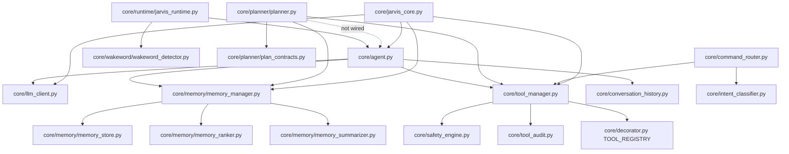

# JARVIS INDIA OS - Project Status

Audit date: 2026-05-31  
Mode: implementation roadmap only, no code generated  
Compatibility rule: preserve existing runtime behavior through additive modules, adapters, and optional integration flags before replacing current paths.

## Completion Summary

Estimated completion percentage: **47%**

Production readiness score: **38 / 100**

Score basis:
- Core assistant runtime exists and is testable in parts.
- Tool execution, local memory, LLM fallback, wake-word runtime, safety authorization, and JSONL audit persistence are present.
- Planner package is skeletal and not yet part of the active `Agent.run_task()` path.
- Execution engine, Memory V2, orchestration state, multi-agent coordination, config schema, and enterprise observability are missing.
- Repository has duplicate product surfaces: `client` vs `frontend`, `server` vs `backend`, and multiple Python assistant prototypes.

## Repository Scan

Scanned source inventory:
- Python files parsed: **77**
- Python parse errors: **0**
- Python circular imports: **0 detected**
- JS/JSX/TS/TSX relative imports checked: **91**
- Missing JS relative imports: **0**
- Total source files scanned excluding dependency/build folders: **159**

Approximate source footprint:
- `core/`: 66 files, 2,833 non-empty LOC
- `server/`: 25 files, 355 non-empty LOC
- `backend/`: 16 files, 280 non-empty LOC
- `client/`: 23 files, 399 non-empty LOC
- `frontend/`: 15 files, 393 non-empty LOC
- root prototypes: 12 files, 513 non-empty LOC
- `python-core/`: 1 file, 219 non-empty LOC

## Verification Snapshot

Passed:
- `.\venv\Scripts\python.exe -m unittest core.test_tool_safeguard -q` passed: 4 tests
- `npm test` passed: backend Node test suite 2/2

Known blocker:
- `pytest` is still not installed in the system Python or project venv, so the broader Python test suite cannot be run through `pytest` yet.

## Current Architecture Analysis

### `core/agent.py`

Status: **partially implemented**

What exists:
- `AgentStep` and `AgentPlan` dataclasses.
- LLM-driven `plan()` function.
- `execute_plan()` loops over plan steps and invokes `ToolManager`.
- Failure path asks the LLM for a one-sentence recovery suggestion.

Main gaps:
- Does not call `core/planner.Planner.optimize()`.
- Does not insert checkpoints before sensitive steps.
- Does not persist run state.
- Does not pass actor identity or request context into `ToolManager.execute_tool()`.
- Uses a simple `max_steps` loop, not a real execution state machine.

### `core/tool_manager.py`

Status: **usable foundation**

What exists:
- Dynamic discovery of decorated tools across `core`.
- Registry lookup and metadata retrieval.
- Safety authorization before tool invocation.
- JSONL audit emission for allowed/error paths.
- `actor_role` and `user` parameters on direct tool execution.

Main gaps:
- Runtime callers mostly do not provide real user/role context.
- Dynamic import discovery is broad and can produce import side effects.
- No typed tool schemas, timeouts, retry policy, budgets, or sandbox.
- Denied tool calls return strings rather than a uniform structured result.

### `core/memory/memory_manager.py`

Status: **functional local memory**

What exists:
- SQLite-backed memory store.
- Short-term in-process memory list.
- ranking and summarization helpers.
- decorated memory tools: save, search, recent, delete.

Main gaps:
- No Memory V2 abstraction for multiple backends.
- No vector or semantic retrieval.
- No namespace/user isolation.
- No memory compaction lifecycle.
- No unified contract with `server/src/models/MemoryEntry.js` or `backend/src/modules/memory/memoryStore.js`.

### `core/runtime/jarvis_runtime.py`

Status: **local interactive runtime**

What exists:
- wake-word loop.
- speech recognition and TTS.
- command handoff into `Agent.run_task()`.
- runtime stop handling.

Main gaps:
- No execution engine boundary.
- No plan/run state.
- No API identity context.
- No telemetry span or run ID.
- No checkpoint/approval UX before sensitive work.
- Depends on local microphone/TTS environment.

### `core/llm_client.py`

Status: **minimal Ollama-compatible client**

What exists:
- Configurable model and base URL through environment variables.
- OpenAI-compatible `/v1/chat/completions` request shape.
- fallback response when model is unreachable.
- tolerant parsing of several response shapes.

Main gaps:
- No provider abstraction in Python.
- No retries, streaming, token accounting, circuit breaker, or model capability registry.
- No structured LLM error taxonomy.
- No request correlation or telemetry.

## FIX_REPORT.md Comparison

| Requirement from `FIX_REPORT.md` | Current status | Finding |
|---|---|---|
| Centralized `SafetyEngine` policy layer | Met | `ToolManager.execute_tool()` calls `SafetyEngine.authorize()`. |
| Sensitive tools require explicit confirmation | Met | Covered by `core/test_tool_safeguard.py`. |
| Role-based checks enforced in execution path | Partially met | Direct `ToolManager` calls enforce roles, but `Agent`, `CommandRouter`, and `JarvisRuntime` do not pass authenticated role context. |
| Fail closed for unregistered tools and unknown permissions | Met | Safety engine denies unregistered tools and unknown permissions. |
| Audit persistence to JSONL | Met | `core/tool_audit.py` writes `logs/tool_audit.jsonl` or `JARVIS_AUDIT_LOG_PATH`. |
| Audit entries reload on initialization | Met | `_initialize_audit_log()` loads persisted JSONL entries. |
| Thread-safe audit reads/writes | Met | guarded by `threading.RLock`. |
| Tests for policy behavior | Partially met | `unittest` tests pass; project still lacks `pytest` dependency for full Python test workflow. |
| Caller identity propagated through runtime path | Partially met | `ToolManager` accepts identity, but higher-level runtime/API paths still need to supply it. |

## Dependency Graph

## Architecture Mismatch Summary

Primary mismatches:
- Planner package exists but active agent execution bypasses it.
- Safety identity exists at tool level but not at runtime/API level.
- Audit is durable at tool level but lacks workflow/request correlation.
- Memory exists in SQLite, Mongo, in-memory JS, and JSON files with no unified contract.
- `server/` and `backend/` overlap as API layers.
- `client/` and `frontend/` overlap as UI layers.
- Root and `python-core/` assistant prototypes duplicate core runtime behavior.

## Broken Imports Report

Confirmed broken import:
- `voice.py` imports `sr`, which is missing. It likely intended `import speech_recognition as sr`.

No missing relative imports detected:
- JS/JSX relative imports checked: 91
- Missing JS/JSX relative imports: 0

## Missing Modules Report

Highest priority missing modules:
- `core/runtime/execution_engine.py`
- `core/runtime/run_context.py`
- `core/runtime/run_state.py`
- `core/memory/v2/*`
- `core/telemetry/*`
- `core/workflow/*`
- `core/agents/*`
- `core/config.py`
- `core/tools/schema.py`
- `server/src/modules/runtime/*`
- `server/src/modules/policy/*`

Detailed implementation sequence is in `IMPLEMENTATION_PLAN.md` and `MISSING_COMPONENTS.md`.

## Production Readiness

Ready today:
- local tool registry and tool calls.
- local SQLite memory.
- LLM fallback behavior.
- basic safety authorization.
- JSONL audit persistence.
- backend smoke API tests.

Not production ready:
- autonomous planning.
- durable workflow execution.
- identity-aware safety across runtime/API.
- typed tool contracts.
- sandboxed OS actions.
- multi-user memory isolation.
- cross-service telemetry.
- multi-agent coordination.

## Release Estimate

MVP readiness estimate: **14-20 engineering days**

Production readiness estimate: **50-75 engineering days**

Autonomous Level-2 estimate: **28-45 engineering days**
